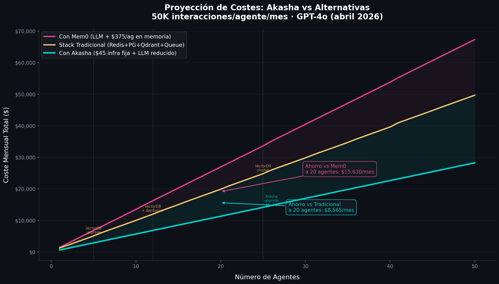
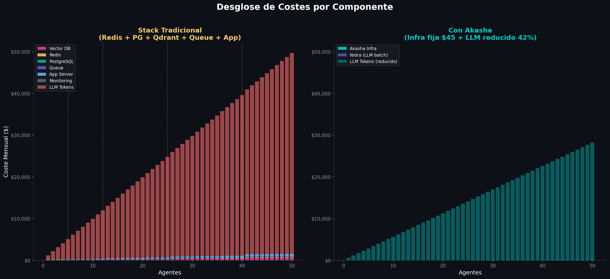
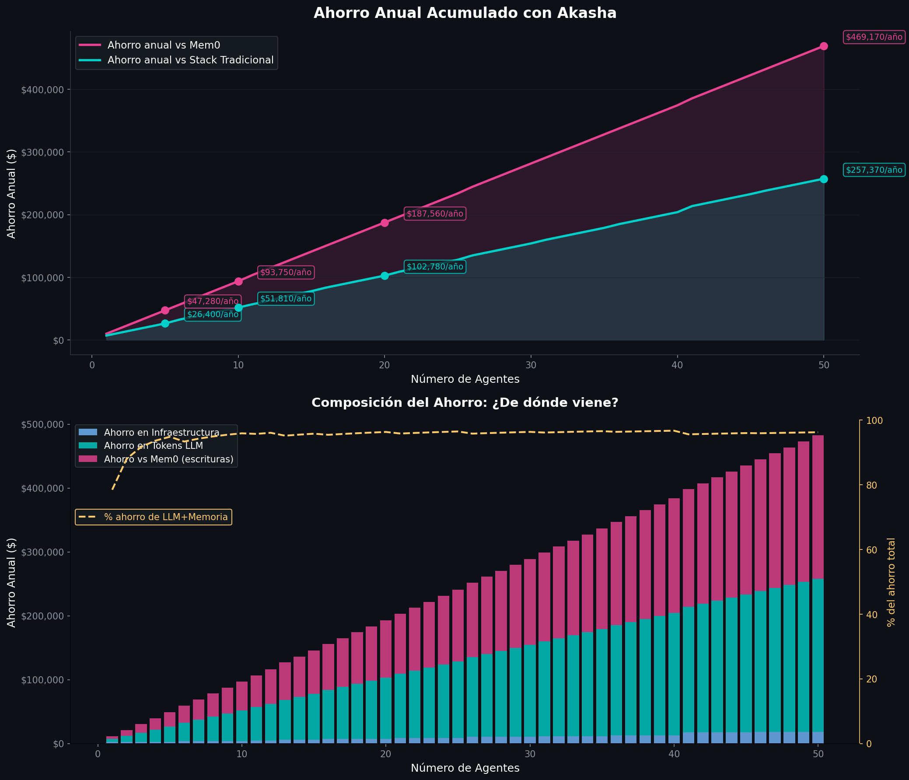
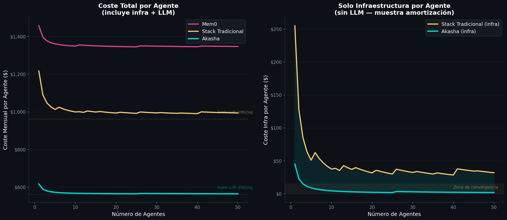

# Proyección de Costes a Escala: Akasha vs Alternativas

## Modelo de costes con hipótesis de crecimiento realistas (1-50 agentes)

---

## Hipótesis del Modelo

Este análisis modela 3 escenarios comparables entre sí, con las mismas 50K interacciones/agente/mes y precios GPT-4o de abril 2026.

### Escenario 1: Con Akasha

| Componente | Modelo de coste | Justificación |
|------------|----------------|---------------|
| **Infraestructura** | Escalonada: $45 (1-25 ag.) → $90 (26-50 ag.) | 3 nodos t3.small bastan hasta 25 agentes. Después, upgrade a t3.medium o 4to nodo |
| **LLM (agente)** | Lineal: $562/agente/mes | Contexto reducido de 4.5K a 1.3K tokens (lee de Akasha, no re-inyecta historial) |
| **Memoria** | Casi plano: ~$10 fijo | Nidra batch processing: 1 LLM call por hora, no por escritura |

**Curva resultante:** Casi lineal. La infra es despreciable. El coste crece con los agentes solo por los tokens LLM (que ya están reducidos un 42%).

### Escenario 2: Stack Tradicional (Redis + PostgreSQL + Qdrant + Queue)

Los componentes **NO escalan en bloque** — cada uno tiene su propio punto de saturación:

| Componente | Escala en... | Coste progresivo | Bottleneck |
|------------|-------------|-----------------|------------|
| **Vector DB** (Qdrant) | 5 → 12 → 25 → 40 ag. | $80 → $150 → $280 → $450 → $700 | **Primero** (RAM intensivo) |
| **App Server** | Cada 5 agentes | $50 → $100 → $150... (lineal) | Segundo |
| **PostgreSQL** | 20 → 40 ag. | $40 → $80 → $150 | Tercero (storage) |
| **Redis** | 15 → 35 ag. | $30 → $60 → $100 | Cuarto (eficiente) |
| **Queue** | 20 → 40 ag. | $25 → $50 → $90 | Último |
| **Monitoring** | 30 ag. | $30 → $60 | Fijo casi siempre |
| **LLM (agente)** | Lineal: $962/ag/mes | Context stuffing 4.5K tokens/interacción | — |

**Curva resultante:** Casi lineal (dominada por LLM) con "escalones" cuando un componente de infra necesita upgrade. El VectorDB es el primero en escalar.

### Escenario 3: Con Mem0

| Componente | Modelo de coste | Justificación |
|------------|----------------|---------------|
| **Infraestructura** | Escalonada: $120 → $200 → $350 → $500 | Menos que tradicional (Mem0 SaaS gestiona parte) |
| **LLM (agente)** | Lineal: $962/agente/mes | Mismo context stuffing que tradicional |
| **LLM (memoria)** | Lineal: $375/agente/mes | 2 llamadas LLM por cada escritura × 50K writes/mes |

**Curva resultante:** La más cara. El doble LLM call por escritura hace que el coste de memoria crezca linealmente con cada agente sin ninguna amortización posible.

---

## Gráfico 1: Comparativa Principal

### Lectura del gráfico

- **Akasha (cyan):** Crece linealmente a $562/agente, casi sin overhead de infra. La línea es la más baja en todo el rango.
- **Tradicional (amarillo):** Crece a $962/agente + escalones de infra. Las líneas punteadas marcan cuando VectorDB necesita upgrade (5, 12, 25 agentes).
- **Mem0 (rosa):** La pendiente más pronunciada ($1,337/agente efectivo) por el doble coste LLM en escrituras de memoria.
- **Las anotaciones** muestran que a 20 agentes, Akasha ahorra **$8,565/mes** vs tradicional y **$15,630/mes** vs Mem0.

---

## Gráfico 2: Desglose por Componente

### Lectura del gráfico

**Panel izquierdo (Stack Tradicional):**
- Los componentes de infraestructura (colores en la base) son una fracción minúscula del coste total
- **LLM Tokens** (rojo) domina completamente — representa >90% del coste
- Las líneas verticales punteadas marcan los puntos de escalado de VectorDB

**Panel derecho (Akasha):**
- **Akasha Infra** (base cyan) es invisible a esta escala — $45-90/mes vs miles en LLM
- **Nidra** (púrpura) es una línea fina — batch processing minimiza el coste
- **LLM Tokens** (cyan claro) es menor que en el tradicional — misma proporción pero 42% menos volumen

**Conclusión visual:** En ambos casos el LLM domina. Pero con Akasha, el LLM consume menos tokens por interacción (1.3K vs 4.5K input).

---

## Gráfico 3: Ahorro Anual Acumulado

### Lectura del gráfico

**Panel superior — Ahorro total:**

| Agentes | Ahorro anual vs Tradicional | Ahorro anual vs Mem0 |
|---------|---------------------------|---------------------|
| 5 | $26,400 | $47,280 |
| 10 | $51,810 | $93,750 |
| 20 | $102,780 | $187,560 |
| 50 | $257,370 | $469,170 |

**Panel inferior — ¿De dónde viene el ahorro?:**
- **Rosa (escrituras Mem0):** La porción más grande del ahorro — eliminar 2 LLM calls por escritura
- **Cyan (tokens LLM):** La segunda porción — reducir contexto de 4.5K a 1.3K tokens
- **Azul (infraestructura):** La porción más pequeña — se aplana con escala
- **Línea amarilla punteada:** Muestra que **~95% del ahorro viene de LLM + Memoria**, no de infra

---

## Gráfico 4: Coste por Agente (Amortización)

### Lectura del gráfico

**Panel izquierdo — Coste total por agente:**
- Todas las líneas convergen hacia su "suelo LLM" a medida que la infra se amortiza
- **Mem0** converge a ~$1,337/ag (LLM agente + LLM memoria)
- **Tradicional** converge a ~$962/ag (LLM agente)
- **Akasha** converge a ~$562/ag (LLM agente reducido)
- La diferencia entre suelos ($962 vs $562 = **$400/ag**) es permanente e irreducible

**Panel derecho — Solo infraestructura por agente:**
- La infra tradicional baja de $255/ag (1 agente) a ~$20/ag (50 agentes) — **amortización fuerte**
- La infra de Akasha baja de $45/ag (1 agente) a ~$1.80/ag (50 agentes)
- A 50 agentes, la diferencia de infra es solo ~$18/ag — **la "zona de convergencia"**
- Esto confirma que **la ventaja de Akasha NO es infra más barata a escala — es LLM más eficiente**

---

## Tabla Resumen

| Agentes | Akasha | Tradicional | Mem0 | Ahorro vs Trad | Ahorro vs Mem0 |
|---------|--------|-------------|------|---------------|---------------|
| 1 | $617 | $1,217 | $1,457 | $600 (49%) | $840 (58%) |
| 3 | $1,741 | $3,141 | $4,131 | $1,400 (45%) | $2,390 (58%) |
| 5 | $2,865 | $5,065 | $6,805 | $2,200 (43%) | $3,940 (58%) |
| 8 | $4,551 | $8,071 | $10,816 | $3,520 (44%) | $6,265 (58%) |
| 10 | $5,678 | $9,995 | $13,490 | $4,318 (43%) | $7,812 (58%) |
| 15 | $8,494 | $14,985 | $20,255 | $6,491 (43%) | $11,761 (58%) |
| 20 | $11,310 | $19,875 | $26,940 | $8,565 (43%) | $15,630 (58%) |
| 30 | $16,988 | $29,830 | $40,460 | $12,842 (43%) | $23,472 (58%) |
| 50 | $28,252 | $49,700 | $67,350 | $21,448 (43%) | $39,098 (58%) |

---

## Conclusiones

### 1. El ahorro de Akasha es consistente (~43% vs tradicional, ~58% vs Mem0)

No se diluye con escala porque viene de **reducir tokens LLM por interacción**, no de infra más barata. A 1 agente o a 50, el ahorro porcentual es prácticamente idéntico.

### 2. La infra converge — pero el LLM no

A 50 agentes, la diferencia de infraestructura entre Akasha y el stack tradicional es solo $18/agente. Pero la diferencia de LLM es $400/agente. **La infra es la ventaja operacional (1 servicio vs 5). El LLM es la ventaja económica.**

### 3. Mem0 tiene un problema estructural de coste

Cada escritura en Mem0 genera 2 llamadas LLM que no se pueden amortizar ni optimizar. A 50 agentes, eso son **$225,000/año solo en escrituras de memoria**. Akasha las hace a $0 (HTTP POST directo).

### 4. La decisión no es solo económica

Además del ahorro cuantificado aquí, Akasha ofrece:
- 1 servicio vs 4-5 (menos complejidad operacional)
- <1ms latencia vs 500-2000ms (mejor UX del agente)
- Zero-vendor lock-in (self-hosted, Rust, sin dependencia de API externa para memoria)

---

## Notas Metodológicas

- **Precios LLM:** GPT-4o abril 2026: $2.50/1M input, $10.00/1M output
- **50K interacciones/agente/mes:** Representativo de SaaS B2B con 2,000 clientes
- **Contexto sin Akasha:** 4,500 tokens input (500 sistema + 4,000 historial)
- **Contexto con Akasha:** 1,300 tokens input (500 sistema + 800 contexto preciso de Akasha)
- **Mem0 escrituras LLM:** 2 llamadas (extracción + dedup) × 1,800 input + 300 output tokens
- **Infra AWS:** Precios on-demand us-east-1, sin reservas
- **VectorDB:** Qdrant self-hosted con upgrades de RAM en cada escalón
- **Script de generación:** `generate_cost_charts.py` (reproducible, mismo directorio)
