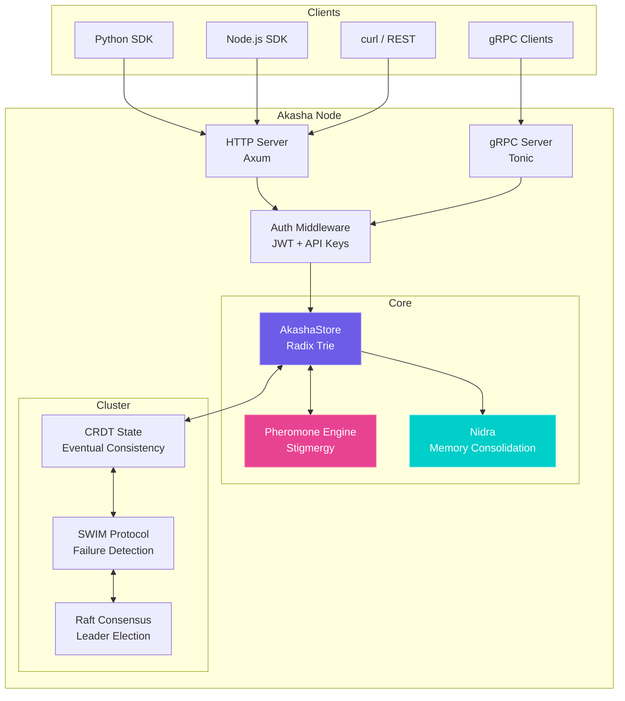
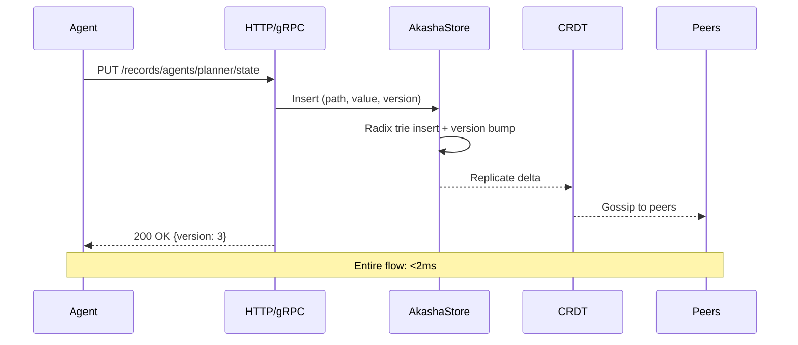

# Architecture

Akasha is built as a modular, layered system designed for sub-millisecond latency at the edge.

## System Overview

## Core Components

### AkashaStore

The heart of Akasha — an in-memory **radix trie** (prefix tree) that provides:

- **O(k) lookups** where k is the key length (not the number of records)
- **Hierarchical paths** — `agents/planner/state` naturally forms a tree
- **Glob pattern queries** — `agents/*/state`, `memory/**`
- **Versioned records** — monotonically increasing version numbers
- **Atomic CAS** — Compare-And-Swap via `If-Match` headers

### Pheromone Engine

Agents coordinate without direct communication using **stigmergy** — the same principle ants use:

1. **Deposit** a signal on a trail with an intensity and half-life
2. **Sense** active trails to discover what other agents have found
3. Signals **decay exponentially** — recent information is stronger
4. Agents **reinforce** useful trails — emergent consensus

### Nidra (Memory Consolidation)

Inspired by how the human brain consolidates memories during sleep:

- **Working memory** (TTL: seconds-minutes) → scratch pad for active tasks
- **Episodic memory** (TTL: hours) → event logs, interactions
- **Semantic memory** (permanent) → distilled knowledge, facts
- **Procedural memory** (permanent) → how-to knowledge, workflows

Nidra periodically moves records from working → episodic → semantic based on access patterns and TTL policies.

### Clustering

Akasha supports 3+ node HA clusters using:

| Protocol | Purpose |
|----------|---------|
| **SWIM** | Failure detection, membership gossip |
| **CRDT** | Conflict-free replicated data types for eventual consistency |
| **Raft** | Leader election, configuration changes |

## Data Flow

## Performance Characteristics

| Operation | Latency (P50) | Latency (P99) |
|-----------|---------------|---------------|
| Write | 1.2ms | 3.5ms |
| Read | 0.8ms | 2.1ms |
| Query (100 results) | 2.5ms | 8.0ms |
| Pheromone deposit | 1.0ms | 2.8ms |
| Pheromone sense | 0.5ms | 1.5ms |

!!! info "Benchmark conditions"
    Measured on a 3-node Docker cluster, single-threaded sequential operations over HTTPS with self-signed certificates.
