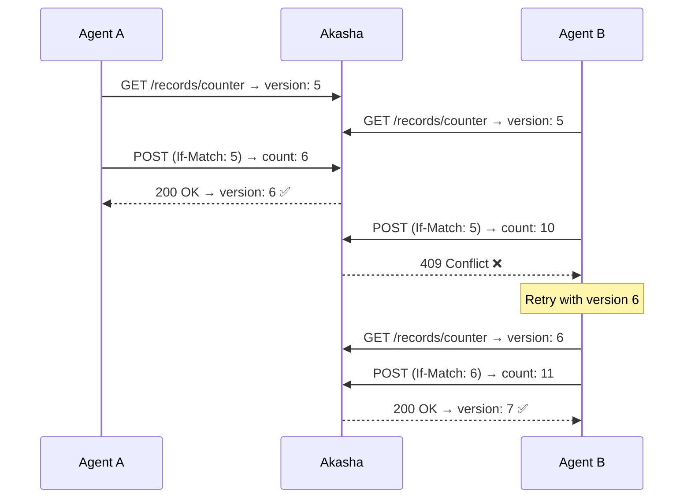

# Compare-And-Swap (CAS)

CAS provides **optimistic concurrency control** — multiple agents can read and write the same record without locking, and conflicts are detected at write time.

## How It Works

1. Agent reads a record and notes its `version`
2. Agent computes its update
3. Agent writes with `If-Match: <version>` header
4. If the version still matches → **write succeeds** (version incremented)
5. If another agent wrote first → **409 Conflict** → retry with fresh version



## Usage

=== "Python"

    ```python
    from akasha import AkashaHttpClient, CasConflictError

    client = AkashaHttpClient(base_url="http://localhost:7777")

    # Read current state
    record = client.get("shared/counter")
    current = record.value["count"]

    try:
        # Atomic update
        client.put_cas(
            "shared/counter",
            {"count": current + 1},
            expected_version=record.version,
        )
    except CasConflictError as e:
        print(f"Conflict! Expected v{e.expected_version}, actual v{e.actual_version}")
        # Retry with fresh data
    ```

=== "Node.js"

    ```typescript
    import { AkashaHttpClient, CasConflictError } from 'akasha-memory';

    const client = new AkashaHttpClient({ baseUrl: 'http://localhost:7777' });

    const record = await client.get('shared/counter');
    
    try {
      await client.putCas(
        'shared/counter',
        { count: record!.value.count + 1 },
        record!.version,
      );
    } catch (e) {
      if (e instanceof CasConflictError) {
        console.log(`Conflict: expected v${e.expectedVersion}`);
      }
    }
    ```

=== "curl"

    ```bash
    curl -s https://localhost:7777/api/v1/records/shared/counter \
      -X POST \
      -H "Content-Type: application/json" \
      -H "If-Match: 5" \
      -d '{"value": {"count": 6}}'
    ```

## When to Use CAS

| Scenario | Use CAS? |
|----------|----------|
| Shared counters / state | ✅ Yes |
| Multiple agents updating the same record | ✅ Yes |
| Append-only logs | ❌ No — use unique paths |
| Agent's own private state | ❌ No — only one writer |
| Configuration changes | ✅ Yes |
