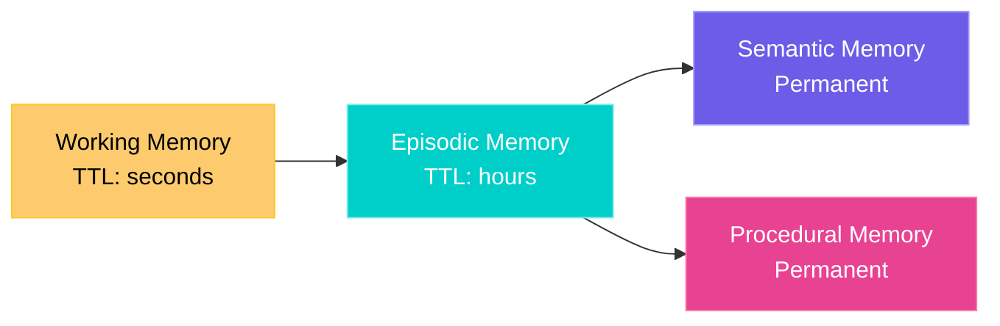

# Memory Layers

Akasha organizes agent knowledge into four cognitive layers, inspired by human memory systems.

## The Four Layers



### Working Memory

Short-term scratch pad for active tasks. Auto-expires.

```python
client.put("memory/working/task-42/context", {
    "current_step": "analyzing",
    "data_loaded": True,
}, ttl_seconds=60)
```

**Path prefix:** `memory/working/`  
**Default TTL:** 60 seconds  
**Use case:** Active task state, intermediate results, scratchpads

### Episodic Memory

Event logs and interaction history. Medium retention.

```python
client.put("memory/episodic/2024-01-15/user-login", {
    "user": "alice",
    "action": "login",
    "timestamp": "2024-01-15T10:30:00Z",
}, ttl_seconds=3600)
```

**Path prefix:** `memory/episodic/`  
**Default TTL:** 1 hour  
**Use case:** Conversation history, audit logs, event sequences

### Semantic Memory

Permanent knowledge. Facts, learned patterns, distilled insights.

```python
client.put("memory/semantic/customers/acme-corp", {
    "preferences": {"channel": "email", "tone": "formal"},
    "industry": "manufacturing",
    "tier": "enterprise",
})
```

**Path prefix:** `memory/semantic/`  
**TTL:** None (permanent)  
**Use case:** Knowledge base, learned preferences, domain facts

### Procedural Memory

How-to knowledge. Workflows, procedures, learned sequences.

```python
client.put("memory/procedural/deploy-canary", {
    "steps": ["build", "test", "deploy-10%", "monitor-5min", "promote"],
    "rollback_on": "error_rate > 1%",
})
```

**Path prefix:** `memory/procedural/`  
**TTL:** None (permanent)  
**Use case:** Standard operating procedures, learned workflows

## Querying Across Layers

```python
# All working memory
working = client.query("memory/working/**")

# All memories about a topic
about_acme = client.query("memory/*/acme-corp/**")

# Layer stats
stats = client.memory_layers()
# → {"working": 38, "episodic": 467, "semantic": 50, "procedural": 2}
```

## Nidra: Memory Consolidation

The **Nidra engine** automatically consolidates memories:

1. Working memory entries that are read frequently → promoted to Episodic
2. Episodic entries with consistent patterns → promoted to Semantic
3. Expired entries → garbage collected

This mirrors how the human brain consolidates short-term memories into long-term storage during sleep.

!!! info "Etymology"
    *Nidra* (निद्रा) is Sanskrit for "sleep" — the state where memory consolidation happens.
