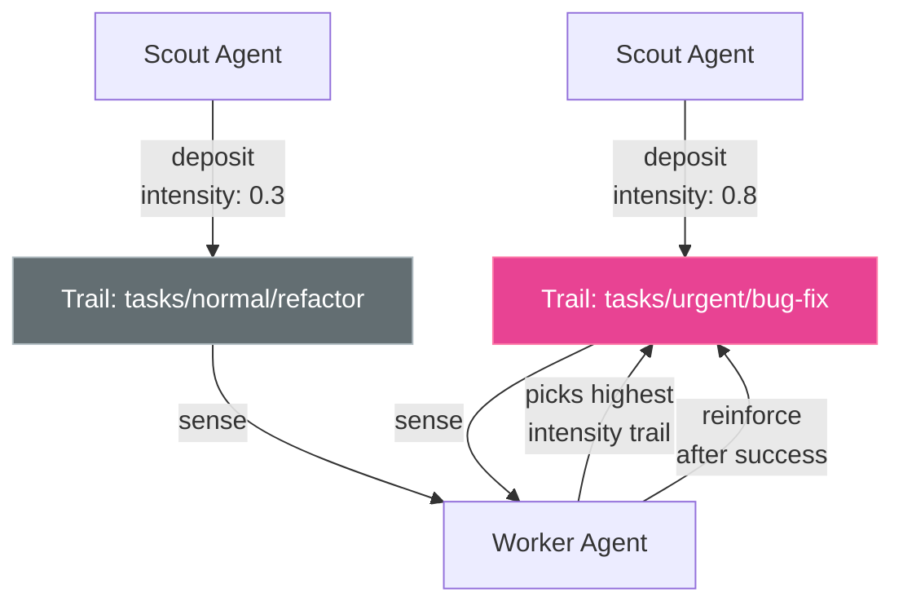

# Pheromones & Stigmergy

Akasha's pheromone system enables **stigmergy** — indirect coordination through the environment, without agents needing to communicate directly.

## How It Works

1. An agent **deposits** a pheromone on a trail (path) with an intensity
2. Other agents **sense** active trails to discover signals
3. Pheromones **decay exponentially** based on their half-life
4. Agents can **reinforce** trails by depositing on existing ones



## Depositing Pheromones

=== "Python"

    ```python
    client.deposit_pheromone(
        trail="discoveries/weather-api",
        signal_type="discovery",
        emitter="scout-01",
        intensity=0.85,
        half_life_secs=1800,
        payload={"api_url": "https://api.weather.com"},
    )
    ```

=== "curl"

    ```bash
    curl -sk https://localhost:7777/api/v1/pheromones \
      -X POST -H "Content-Type: application/json" \
      -d '{
        "trail": "discoveries/weather-api",
        "signal_type": "discovery",
        "emitter": "scout-01",
        "intensity": 0.85,
        "half_life_secs": 1800,
        "payload": {"api_url": "https://api.weather.com"}
      }'
    ```

## Sensing Pheromones

```python
trails = client.sense_pheromones()
for t in trails:
    print(f"{t.trail}: intensity={t.current_intensity:.2f} ({t.signal_type})")
```

## Signal Types

| Type | Use Case |
|------|----------|
| `discovery` | "I found something useful here" |
| `success` | "This approach worked well" |
| `failure` | "Avoid this path" |
| `warning` | "Caution — proceed carefully" |
| `reinforcement` | "Confirming an existing signal" |

## Decay & Half-Life

Pheromone intensity decays exponentially:

$$I(t) = I_0 \cdot 2^{-t / t_{1/2}}$$

- A trail with `intensity=1.0` and `half_life_secs=3600` will be at `0.5` after 1 hour
- This naturally prioritizes **recent information** over stale signals
- Trails that are not reinforced eventually disappear

!!! tip "Choosing half-life"
    - **Short tasks** (minutes): `half_life_secs=300`
    - **Daily workflows**: `half_life_secs=3600`
    - **Persistent signals**: `half_life_secs=86400`
