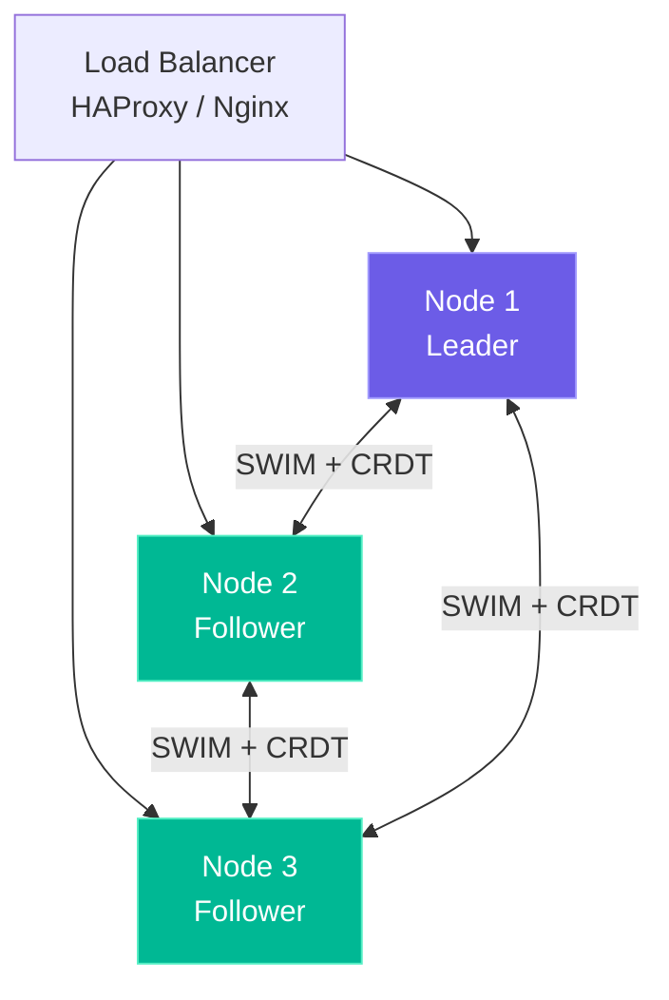

# Clustering

Deploy Akasha as a 3+ node HA cluster with automatic failover.

## Architecture



## Docker Compose (3-Node)

```yaml
version: '3.8'
services:
  akasha-01:
    image: alejandrosl/akasha:latest
    environment:
      - AKASHA_CLUSTER_ENABLED=true
      - AKASHA_CLUSTER_NODE_ID=akasha-01
      - AKASHA_CLUSTER_PEERS=akasha-02:7946,akasha-03:7946
    ports:
      - "7771:7777"

  akasha-02:
    image: alejandrosl/akasha:latest
    environment:
      - AKASHA_CLUSTER_ENABLED=true
      - AKASHA_CLUSTER_NODE_ID=akasha-02
      - AKASHA_CLUSTER_PEERS=akasha-01:7946,akasha-03:7946
    ports:
      - "7772:7777"

  akasha-03:
    image: alejandrosl/akasha:latest
    environment:
      - AKASHA_CLUSTER_ENABLED=true
      - AKASHA_CLUSTER_NODE_ID=akasha-03
      - AKASHA_CLUSTER_PEERS=akasha-01:7946,akasha-02:7946
    ports:
      - "7773:7777"
```

## Verify Cluster

```bash
curl -sk https://localhost:7771/api/v1/cluster/nodes | jq
```
