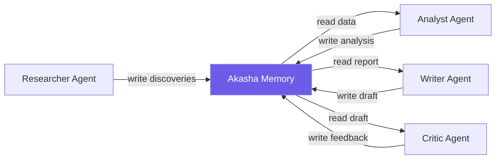

# LangGraph + Akasha Pipeline

A complete example of 4 AI agents sharing knowledge through Akasha — zero orchestration.

## Architecture



## How It Works

1. **Researcher** gathers data → writes to `memory/working/research/*`
2. **Analyst** reads research → writes analysis to `memory/episodic/analysis/*`
3. **Writer** reads analysis → writes draft to `memory/working/draft`
4. **Critic** reads draft → writes feedback to `memory/semantic/feedback/*`

No agent talks to another directly. They coordinate through shared memory.

## Run It

```bash
cd examples/langgraph-memory
pip install -r requirements.txt
python pipeline.py
```

## Source Code

See the full example on GitHub: [`examples/langgraph-memory/`](https://github.com/ocuil/akasha-public/tree/main/examples/langgraph-memory)
