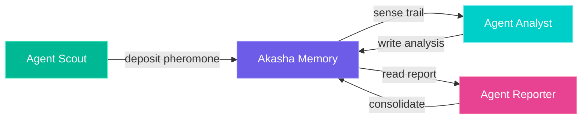

# Akasha

**The shared cognitive fabric for intelligent agent systems.**

[](https://pypi.org/project/akasha-client/)
[](https://www.npmjs.com/package/akasha-memory)
[](https://hub.docker.com/r/alejandrosl/akasha)

---

## What is Akasha?

Akasha is a **distributed, real-time key-value fabric** designed specifically for multi-agent AI systems. It gives your agents:

- :brain: **Shared Memory** — Working, Episodic, Semantic, and Procedural layers
- :ant: **Stigmergy** — Pheromone-based coordination (no message passing needed)
- :zap: **Sub-millisecond latency** — Faster than your LLM can think
- :lock: **CAS** — Compare-And-Swap for conflict-free concurrent writes
- :globe_with_meridians: **Clustering** — 3-node HA with CRDT + Raft consensus
- :bar_chart: **Observability** — Prometheus metrics, Grafana dashboards

## Quick Start

Get Akasha running in 30 seconds:

=== "Docker"

    ```bash
    docker run -d -p 7777:7777 -p 50051:50051 alejandrosl/akasha:latest
    ```

=== "Python"

    ```bash
    pip install akasha-client
    ```

    ```python
    from akasha import AkashaHttpClient

    client = AkashaHttpClient(base_url="https://localhost:7777")
    client.put("agents/planner/state", {"status": "thinking"})
    
    state = client.get("agents/planner/state")
    print(state.value)  # {"status": "thinking"}
    ```

=== "Node.js"

    ```bash
    npm install akasha-memory
    ```

    ```typescript
    import { AkashaHttpClient } from 'akasha-memory';

    const client = new AkashaHttpClient({
      baseUrl: 'https://localhost:7777',
    });

    await client.put('agents/planner/state', { status: 'thinking' });
    const state = await client.get('agents/planner/state');
    ```

=== "curl"

    ```bash
    # Write
    curl -sk https://localhost:7777/api/v1/records/agents/planner/state \
      -X POST -H "Content-Type: application/json" \
      -d '{"value": {"status": "thinking"}}'

    # Read
    curl -sk https://localhost:7777/api/v1/records/agents/planner/state
    ```

## Why Akasha?

Most agent frameworks treat memory as an afterthought — a vector DB bolted on the side.

Akasha takes a fundamentally different approach: **memory is the coordination layer itself.** Agents don't need to talk to each other. They read and write to shared memory. They leave pheromone trails. They coordinate through the environment, not through messages.

This is **stigmergy** — the same mechanism ants use to build colonies without a central coordinator.



## Architecture

| Component | Purpose |
|-----------|---------|
| **AkashaStore** | In-memory radix trie with versioning |
| **Pheromone Engine** | Stigmergy signals with exponential decay |
| **Nidra** | Memory consolidation (working → long-term) |
| **CRDT + Raft** | Distributed consensus + eventual consistency |
| **gRPC + HTTP** | Dual protocol access with WebSocket streaming |

## Next Steps

<div class="grid cards" markdown>

-   :material-rocket-launch:{ .lg .middle } **Quick Start Guide**

    ---

    Get Akasha running and execute your first operations in 5 minutes.

    [:octicons-arrow-right-24: Quick Start](getting-started/quickstart.md)

-   :material-book-open-variant:{ .lg .middle } **Core Concepts**

    ---

    Understand memory layers, pheromones, and stigmergy coordination.

    [:octicons-arrow-right-24: Concepts](concepts/architecture.md)

-   :material-language-python:{ .lg .middle } **SDKs**

    ---

    Python and Node.js clients with full type support.

    [:octicons-arrow-right-24: SDKs](sdks/python.md)

-   :material-api:{ .lg .middle } **API Reference**

    ---

    Interactive OpenAPI documentation with 21 endpoints.

    [:octicons-arrow-right-24: API Reference](sdks/rest-api.md)

</div>
