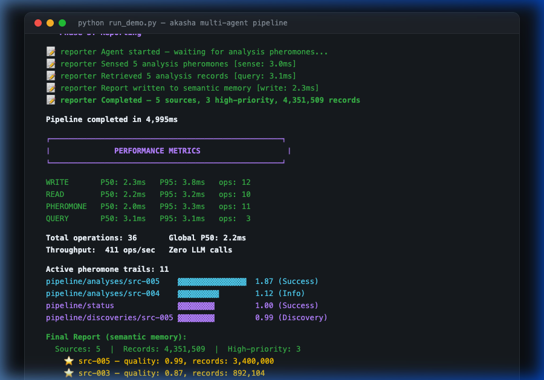

# 🐜 Multi-Agent Stigmergy Pipeline

> Three autonomous agents coordinate through **pheromone trails** in Akasha's shared cognitive fabric — without ever talking to each other.

<div align="center">

</div>

This demo showcases **stigmergy** — the same coordination mechanism used by ant colonies — applied to a data processing pipeline. Each agent operates independently, reading and writing to the shared memory fabric. Coordination emerges naturally from the pheromone signals left in the environment.

## The Pipeline

```
🔍 Scout        📊 Analyst        📝 Reporter
   │                │                  │
   │ discovers      │ senses           │ senses
   │ data sources   │ discovery        │ analysis
   │                │ pheromones       │ pheromones
   ▼                ▼                  ▼
┌─────────────────────────────────────────────────┐
│               A K A S H A                       │
│         Shared Cognitive Fabric                 │
│                                                 │
│  Working Memory ─→ Episodic Memory ─→ Semantic  │
│  (scout writes)    (analyst writes)   (report)  │
│                                                 │
│  🐜 Pheromone Trails:                           │
│    pipeline/discoveries/src-001  ▓▓▓▓ 0.30      │
│    pipeline/discoveries/src-005  ▓▓▓▓▓▓▓▓ 0.99  │
│    pipeline/analyses/src-003     ▓▓▓▓▓▓▓ 0.87   │
│    pipeline/status               ▓▓▓▓▓▓▓▓ 1.00  │
└─────────────────────────────────────────────────┘
```

**No message passing. No queues. No orchestrator.** The environment IS the communication medium.

## Quick Start

### Prerequisites

- [Akasha](https://github.com/ocuil/akasha) running locally (Docker or built from source)
- Python 3.10+

### Run

```bash
# Install dependencies
pip install -r requirements.txt

# Run the demo (Akasha must be running on https://localhost:7777)
python run_demo.py

# Or with custom Akasha URL and credentials
AKASHA_URL=https://my-server:7777 AKASHA_USER=admin AKASHA_PASS=secret python run_demo.py
```

### Expected Output

```
╔══════════════════════════════════════════════════════════════════╗
║          Akasha — Multi-Agent Stigmergy Pipeline Demo           ║
╚══════════════════════════════════════════════════════════════════╝

── Phase 1: Discovery ──────────────────────────────────────

  🔍 scout    Discovered: Weather Station Alpha (1,284 records) [write: 2.2ms]
  🔍 scout    Discovered: IoT Sensor Grid B7 (892,104 records)  [write: 2.7ms]
  🔍 scout    Discovered: Live Clickstream (3,400,000 records)   [write: 2.5ms]

── Phase 2: Analysis ───────────────────────────────────────

  📊 analyst  Sensed 5 discovery pheromones
  📊 analyst  Analyzed: Live Clickstream → quality=0.99 ⭐
  📊 analyst  Analyzed: IoT Sensor Grid B7 → quality=0.87 ⭐

── Phase 3: Reporting ──────────────────────────────────────

  📝 reporter Retrieved 5 analysis records
  📝 reporter Report: 3 high-priority sources, 4,351,509 records

┌──────────────────────────────────────────────────────────────────┐
│                        PERFORMANCE METRICS                      │
└──────────────────────────────────────────────────────────────────┘

  WRITE         P50:    2.4ms  P95:    3.9ms
  READ          P50:    2.8ms  P95:    3.4ms
  PHEROMONE     P50:    1.9ms  P95:    3.4ms

  Total operations: 44
  Global P50:       2.4ms
  Throughput:       403 ops/sec (single-threaded)
```

## How It Works

### Agent 1: Scout 🔍

The Scout discovers data sources and writes each one to **working memory** (short-term, like a scratchpad). For each discovery, it deposits a **pheromone** with intensity proportional to the data size.

```python
# Write to working memory
client.put("memory/working/scout/discovery-src-003", {
    "name": "IoT Sensor Grid B7",
    "records_available": 892_104,
})

# Deposit discovery pheromone (stronger = more data)
client.deposit_pheromone(
    trail="pipeline/discoveries/src-003",
    signal_type="discovery",
    emitter="scout",
    intensity=0.89,  # proportional to data size
)
```

### Agent 2: Analyst 📊

The Analyst **senses pheromone trails** and processes data in order of signal strength — strongest trails first. It writes results to **episodic memory** (what happened, indexed by time) and deposits its own pheromones.

```python
# Sense discovery pheromones — follow the strongest!
trails = client.sense_pheromones("pipeline/discoveries/*")
for trail in sorted(trails, key=lambda t: t["current_intensity"], reverse=True):
    # Read the discovery, analyze, write to episodic memory
    client.put(f"memory/episodic/pipeline/analysis-{source_id}", result)
```

### Agent 3: Reporter 📝

The Reporter waits for analysis pheromones, queries **all analyses** from episodic memory, then consolidates into a **semantic memory** record — long-term knowledge that persists across sessions and gets refined by Nidra.

```python
# Query all analyses from episodic memory
analyses = client.query("memory/episodic/pipeline/*")

# Write consolidated report to semantic memory (long-term!)
client.put("memory/semantic/pipeline/latest-report", report)
```

## Key Concepts Demonstrated

| Concept | Where in the demo |
|---------|-------------------|
| **Stigmergy** | Agents coordinate through pheromone trails, not direct messages |
| **Intensity-based priority** | Analyst processes strongest pheromone trails first |
| **Memory hierarchy** | Working → Episodic → Semantic (mirrors human cognition) |
| **Zero LLM calls** | All 44 operations are pure data operations (P50: 2.4ms) |
| **Emergent coordination** | No orchestrator decides the order — agents self-organize |
| **Pheromone accumulation** | Multiple deposits on the same trail increase intensity |

## Files

| File | Description |
|------|-------------|
| `run_demo.py` | Main demo script — 3 agents + metrics |
| `akasha_client.py` | Lightweight HTTP client (no SDK dependency) |
| `requirements.txt` | Only `requests` — minimal dependencies |

## Configuration

| Variable | Default | Description |
|----------|---------|-------------|
| `AKASHA_URL` | `https://localhost:7777` | Akasha server URL |
| `AKASHA_USER` | `akasha` | Authentication username |
| `AKASHA_PASS` | `akasha` | Authentication password |

## License

Same as [Akasha](../../LICENSE) — ASL-1.0
